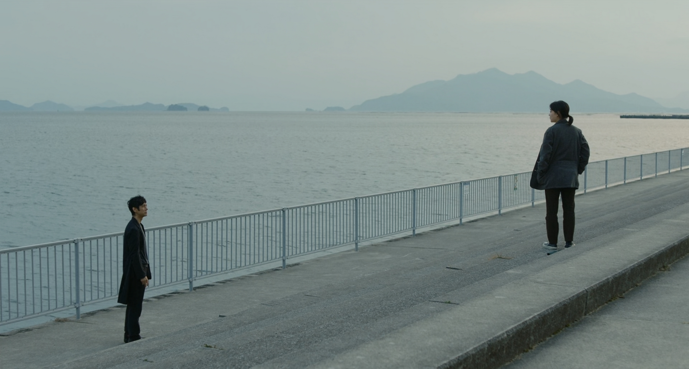
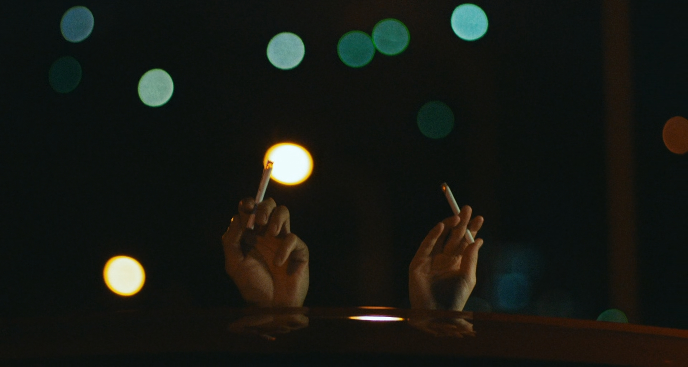
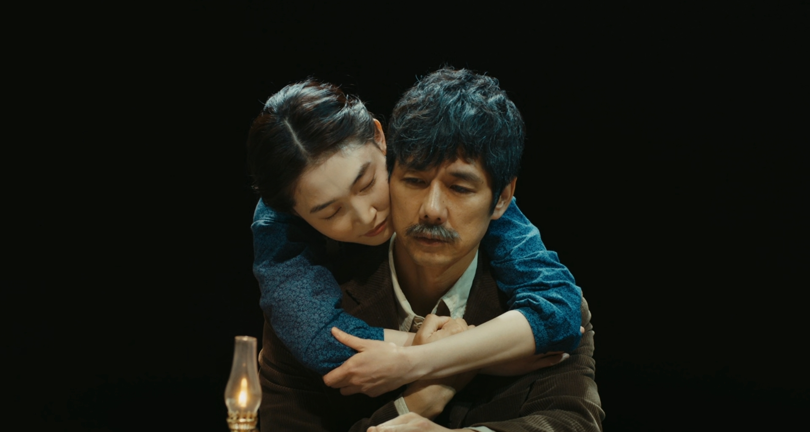

Drive My Car là bộ phim chuyển thể thứ hai từ các tác phẩm của nhà văn Haruki Murakami mà mình xem (sau Burning), cũng là bộ phim điện ảnh người đóng Nhật Bản đầu tiên mà mình xem (anime thì cũng xem được tương đối các bộ của Ghibli). Phim đạo diễn bởi Ryusuke Hamaguchi, với sự tham gia của dàn diễn viên bao gồm Hidetoshi Nishijima, Toko Miura, Reika Kirishima, Park Yu-rim,.. Về đạo diễn và diễn viên của phim thì mình không có nhiều thông tin vì là lần đầu xem điện ảnh Nhật Bản. Drive My Car là câu chuyện kể về người đàn ông Yusuke Kafuku, một diễn viên kiêm đạo diễn sân khấu kịch, cùng hành trình anh đối mặt với cái chết của vợ mình và đạo diễn vở kịch Uncle Vanya đa ngôn ngữ. Bộ phim đã tạo nên lịch sử cho điện ảnh Nhật Bản khi được đề cử ở hạng mục Best Picture ở Oscar 2022, đánh dấu lần đầu tiên một bộ phim Nhật Bản được đề cử ở hạng mục này.

Tương tự như Burning, sau khi xem xong phim mình cảm thấy khá hụt hẫng vì cốt truyện tương đối đơn giản, không có nhiều điểm nhấn. Với một người thích nhiều drama như mình, đơn giản là mình cảm thấy chưa được thỏa mãn. Nhưng không hiểu sao, phim khiến mình không ngừng suy nghĩ về nó. Cốt truyện đơn giản nhưng khắc họa vô cùng thành công những diễn biến tâm lý của nhân vật chính. Phim mang đến một bầu không khí ảm đạm, nhạt nhòa như chính tâm trạng bên trong của Yusuke. Anh sống một cách lặng lẽ, khép mình, luôn lịch thiệp với người khác nhưng tâm hồn thực chất đã rỉ máu từ lâu. Ẩn sâu bên trong anh luôn là sự hối hận, dằn vặt vì cái chết của người vợ. Yusuke trốn tránh mọi thứ, với cả vở kịch mà anh đã thuộc lòng, để không phải đối diện với nỗi đau. Phim chính là hành trình Yusuke chữa lành những vết thương, qua những cuộc trò chuyện với cô gái Watari làm nghề tài xế. Chiếc xe ô tô lâu năm chính là nơi đã kết nối hai tâm hồn đầy những vết xước lại với nhau. Thực sự khi xem xong phim mình mới nhận ra rằng, khi cùng ngồi trong cùng một chiếc xe, cũng là lúc đồng hành với nhau cả một hành trình dài, chúng ta rất dễ để dãi bày những câu chuyện. Hai nhân vật trong phim cũng vậy, vốn xa lạ, sống khép mình, chẳng cùng độ tuổi hay nghề nghiệp, lại trở nên đồng điệu đến kì lạ. Sự đồng điệu đến dần qua những câu chuyện, để họ thấu hiển nhau hơn. Hai người dạy nhau cách thấu hiểu, cách hàn gắn lại những vết thương lòng. Phim còn là bài học về cách đối diện với sự thật, dù nó có đau lòng. Ta phải chấp nhận một điều, sẽ luôn có một điểm mù mà ta không bao giờ có thể nhìn thấy từ người khác, dù ta có cho rằng mình hiểu người đó đến đâu đi chăng nữa. Hành trình đạo diễn vở kịch Uncle Vanya của Yusuke cũng chính là hành trình anh thay đổi, mạnh mẽ và dũng cảm hơn. Cuối cùng thì anh cũng đã có thể trở lại đóng chính vở kịch này. Phim có một kết thúc cực kỳ trọn vẹn, khi chính là lúc vở kịch truyền đi thông điệp hãy can đảm đối diện với những khó khăn cho đến khi an nghỉ, hoàn toàn bằng ngôn ngữ ký hiệu, như vừa gửi gắm tới nhân vật chính, vừa gửi gắm tới những người xem chúng ta.

Phim đem đến những khung hình tĩnh lặng nhưng đầy chất thơ của xứ sở hoa anh đào. Bối cảnh tại thành phố Hiroshima hiện lên qua những con đường khá vắng lặng. Những khung cảnh yên bình, con đường bên bờ biển, thậm chí là cả những bãi rác hiện lên thật đẹp, làm mình chỉ muốn đi ngay một chuyến đến nơi này. Tông màu mà đạo diễn sử dụng trong phim là khá lạnh, như để ám chỉ cho tâm trạng của các nhân vật. Nhiều phân đoạn đã để lại nhiều ấn tượng trong tâm trí mình, như hình ảnh hai nhân vật cùng nhau châm điếu thuốc lá, hay như phân đoạn cuối cùng, nơi chỉ hoàn toàn được truyền tải bằng ngôn ngữ kí hiệu. Phim có một số cảnh nóng, nhưng hoàn toàn hợp lý, phục vụ cho mục đích câu chuyện và truyền tải tâm lý nhân vật. Nếu không có những cảnh này, sẽ khó lòng đạo diễn có thể truyền tải được hết mối quan hệ giữa Yusuke và vợ mình cho người xem.

Các diễn viên hoàn thành xuất sắc vai trò của mình. Trong vai nhân vật chính Yusuke, nam diễn viên Hidetoshi Nishijima toát ra một vẻ ngoài mà chỉ cần nhìn vào người ta đã cảm nhận được một nỗi buồn (mình thấy khá giống với So Ji Sub). Anh diễn tả trọn vẹn những nỗi đau, dằn vặt của nhân vật chính, dù không có nhiều cảnh thể hiện cảm xúc, nhưng chỉ bằng ánh mắt người xem cũng có thể cảm nhận được. Tương tự như Hidetoshi, nhân vật nữ tài xế cũng mang một vẻ ngoài tương tự, đầy những nổi buồn mà người ta có thể nhìn thấy trong ánh mắt. Trong khi đó vợ chồng … lại như là nguồn năng lượng tích cực, tràn đầy những hi vọng, đem đến một ánh sáng như giải thoát cho tâm trạng của các nhân vật trong phim.

Mình nghĩ rằng sự thành công của một bộ phim không phải là cảm giác sau khi xem xong, mà sau một thời gian ta sẽ còn nhớ gì về bộ phim đó. Có lẽ đạo diễn đã quá thành công trong việc găm từ từ nhưng sâu sắc những cảm xúc của nhân vật vào trong người xem. Drive My Car còn mang những thông điệp đầy tính nhân văn, truyền tải một cách đầy nhẹ nhàng, tinh tế, không giáo điều. Có lẽ truyện của nhà văn Murakami luôn như vậy, đầy tính ẩn dụ, man mác buồn, có chút bí bách, ngột ngạt, nhưng luôn là sự giải thoát ở cuối phim. Chắc chắn mình sẽ còn xem lại bộ phim này nhiều lần nữa, để hi vọng mỗi lần xem mình nhận ra được một điều gì đó mới mẻ hơn.

## Trailer

    <iframe src="https://www.youtube.com/embed/6BPKPb_RTwI" frameborder="0" allowfullscreen></iframe>

